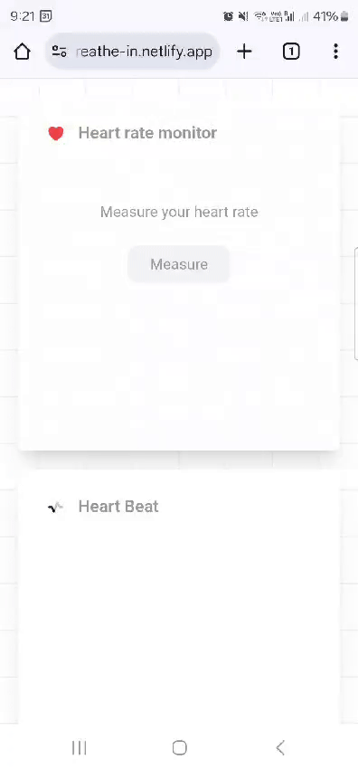

# Heart Rate Monitoring Application

This project consists of a React frontend built using Vite and a Python Flask backend. Follow the instructions below to set up and run the application.



## Prerequisites

Ensure you have the following installed on your system:

- [Node.js](https://nodejs.org/) (LTS version recommended)
- [Python](https://www.python.org/downloads/) (version 3.7 or higher)
- [Pip](https://pip.pypa.io/en/stable/installation/)

## Setup Instructions

### 1. Clone the Repository

```bash
git clone <repository-url>
cd <repository-folder>
```

### 2. Frontend Setup (React + Vite)

1. Install the dependencies:

   ```bash
   npm install
   ```

2. Update the API base URL in `api.js`:

   Open `src/api.js` and set the `BASE_URL` to the URL of your Flask backend. For example:

   ```javascript
   const BASE_URL = "http://localhost:5000"; // Replace with your backend URL
   ```

3. Start the React development server:

   ```bash
   npm run dev
   ```

   The development server will run at `http://localhost:5173`.

### 3. Backend Setup (Flask)

1. Navigate to the `backend` directory:

   ```bash
   cd ../backend
   ```

2. Create a virtual environment (optional but recommended):

   ```bash
   python -m venv venv
   source venv/bin/activate  # On Windows: venv\Scripts\activate
   ```

3. Install the Python dependencies:

   ```bash
   pip install -r requirements.txt
   ```

4. Run the Flask development server:

   ```bash
   flask run
   ```

   By default, the Flask backend will run at `http://localhost:5000`.

### 4. Access the Application

1. Open your browser and navigate to the React app at `http://localhost:5173`.
2. The React app will communicate with the Flask backend running at `http://localhost:5000`.

## Troubleshooting

### Common Issues

1. **CORS Errors**:

   - Ensure CORS is configured correctly in your Flask app. Add this to your Flask app to allow requests from the frontend:
     ```python
     from flask_cors import CORS
     CORS(app)
     ```

2. **Port Conflicts**:
   - Ensure the frontend (`5173`) and backend (`5000`) are not already in use by other applications.

### Useful Commands

#### Frontend

- Start development server: `npm run dev`
- Build for production: `npm run build`
- Preview production build: `npm run preview`

#### Backend

- Start Flask server: `flask run`
- Install dependencies: `pip install -r requirements.txt`

## License

This project is licensed under the [MIT License](LICENSE).

## Contributing

Contributions are welcome! Please fork the repository and submit a pull request.

---

Happy Coding!
